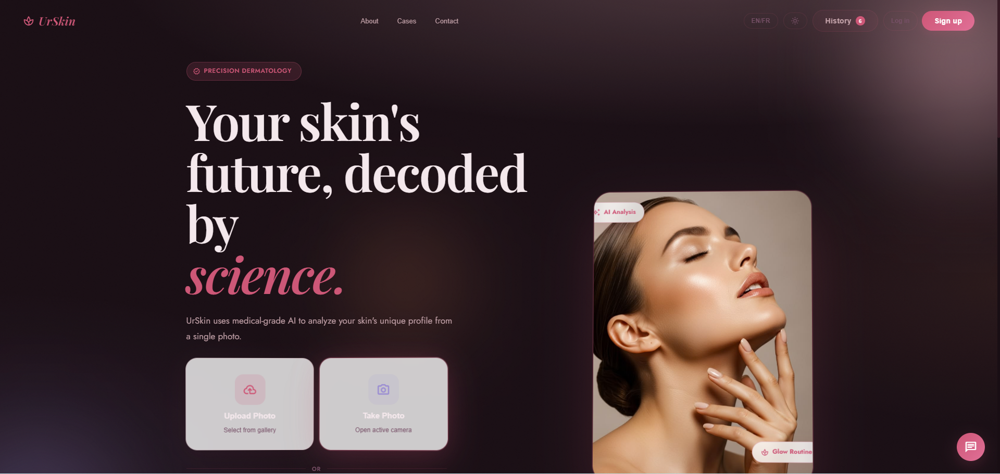

# UrSkin AI

> Computer vision-powered skincare analysis & personalized routine builder.

Detect your skin condition from a photo using MobileNetV2 (80.18% accuracy), identify root causes via a lifestyle questionnaire, and get a custom product routine — or skip the photo entirely and build your routine directly from your beauty goals.

---

## Screenshots

<!-- Add screenshots here — see "Adding Screenshots" section below -->

---

## Features

- **AI Skin Analysis** — Upload a selfie or use your camera to detect your skin condition (acne levels, eczema, rosacea, normal skin)
- **Facial Zone Mapping** — Identifies which zones of your face are affected (T-zone, cheeks, jawline...)
- **Root Cause Detection** — 12-question lifestyle questionnaire (hormonal, stress, diet, friction factors)
- **Glow Routine Builder** — Choose 13 beauty goals + skin profile → personalized product routine, no photo needed
- **35-Product Database** — Smart matching by skin type, budget, sensitivity, climate, experience level
- **Secure Accounts** — Register & login with HMAC-signed tokens
- **Bilingual** — Full French / English interface

---

## Tech Stack

| Layer | Technology |
|-------|------------|
| Frontend | React 18 + Vite 5 |
| Styling | CSS Custom Properties — Petal OS design system |
| Animations | Framer Motion + CSS keyframes |
| Backend | FastAPI + Uvicorn |
| AI Model | MobileNetV2 fine-tuned on 5,261 clinical images |
| Auth | HMAC-SHA256 signed tokens (30-day TTL) |

---

## Model Performance

| Metric | Value |
|--------|-------|
| Architecture | MobileNetV2 fine-tuned |
| Dataset | 5,261 clinical images |
| Test Accuracy | **80.18%** |
| F1-score (weighted) | **0.80** |
| ROC-AUC (weighted) | **97.05%** |
| Classes | Level_0 · Level_1 · Level_2 · Eczema · Rosacea · Normal |

---

## Getting Started

### Prerequisites

- Python 3.10–3.12 (TensorFlow incompatible with 3.13+)
- Node.js 18+
- The trained model file in `skin-analyzer-train/models/`

### Start the backend

```bash
# Windows — double-click or run:
.\restart_backend.bat

# Manual:
cd backend
..\skin-analyzer-train\venv\Scripts\uvicorn.exe main:app --host 0.0.0.0 --port 8000 --reload
```

### Start the frontend

```bash
cd frontend
npm install
npm run dev
```

Open **http://localhost:5173**

### Services

| Service | URL |
|---------|-----|
| App (frontend) | http://localhost:5173 |
| API docs (Swagger) | http://localhost:8000/docs |
| API health | http://localhost:8000/api/health |

---

## API Endpoints

| Method | Route | Description |
|--------|-------|-------------|
| `GET` | `/api/health` | Status + model classes |
| `POST` | `/api/full` | Predict + zones + causes |
| `POST` | `/api/glow-routine` | Generate product routine |
| `POST` | `/api/auth/register` | Create account |
| `POST` | `/api/auth/login` | Login → token |
| `GET` | `/api/auth/me` | Get profile (Bearer token) |

---

## User Flows

**PATH 1 — Photo Analysis**
```
Landing → Upload/Camera → AI Analysis → Results → Questionnaire → Report → Glow Routine
```

**PATH 2 — Direct Routine (no photo needed)**
```
Landing → "Build my routine" → Select goals (13 options) → Skin profile → Personalized routine
```

---

## Project Structure

```
urskin-ai/
├── backend/
│   ├── main.py                      # FastAPI app + endpoints
│   ├── auth.py                      # Auth (HMAC tokens, password hashing)
│   ├── product_matcher.py           # Routine matching algorithm
│   ├── cause_engine.py              # Acne cause inference engine
│   ├── zone_detector.py             # Facial zone detection (OpenCV)
│   └── skincare_product_database.json
└── frontend/src/
    ├── App.jsx                      # Main router + auth state
    ├── LandingPage.jsx              # Landing page
    ├── api.js                       # HTTP layer (Axios)
    ├── i18n.js                      # FR/EN translations
    └── steps/
        ├── AnalyzingStep            # Loading screen
        ├── ResultStep               # AI results + zone map
        ├── QuestionnaireStep        # Lifestyle questionnaire
        ├── ReportStep               # Causes + routine
        ├── GlowRoutine              # Routine component
        └── GlowRoutinePage          # Standalone routine page
```

---

## Adding Screenshots

Screenshots make your README much more attractive. Here's how to add them:

**Step 1 — Take screenshots**
- Take a screenshot of each main screen (Windows: `Win + Shift + S`, then save as PNG)
- Save them in a folder, e.g. `screenshots/`

**Step 2 — Upload to GitHub**
- Go to your repo: https://github.com/radiaboujdid11/urskin-ai
- Click **"Add file" → "Upload files"**
- Drag your PNG files into the `screenshots/` folder (create it by typing `screenshots/` in the path)
- Commit the upload

**Step 3 — Add to README**
Replace the placeholder above with:
```markdown
## Screenshots

| Landing Page | Skin Analysis | Glow Routine |
|---|---|---|
|  |  |  |
```

---

## Disclaimer

For informational purposes only. Does not replace professional medical or dermatological advice.

---

*UrSkin v2.0 — Radia Boujdid — 2026*
